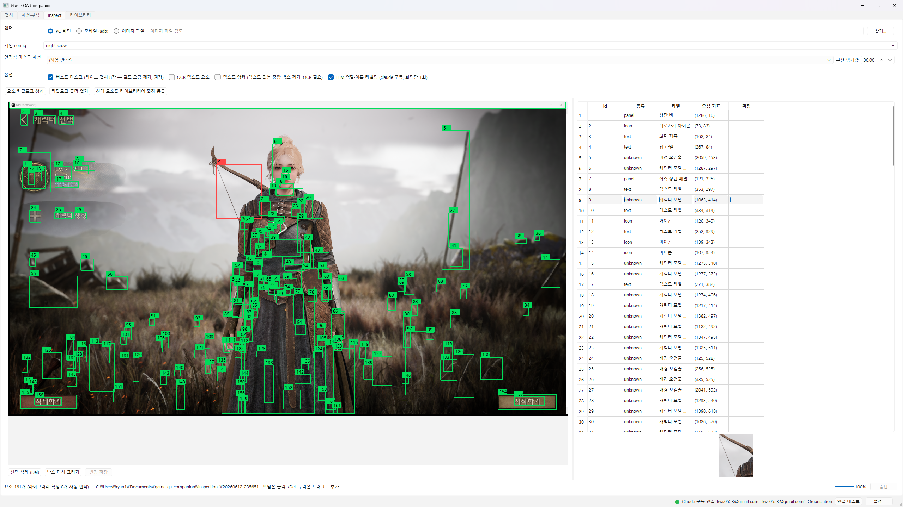
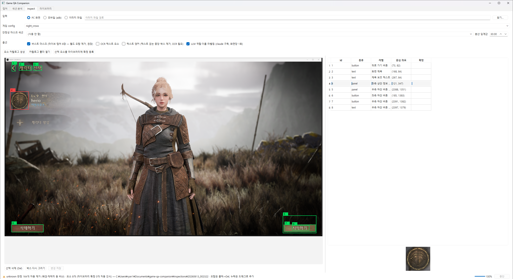
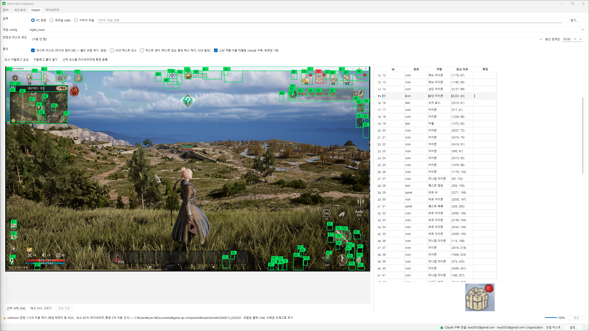

# 데모

나이트 크로우(MMORPG) PC 클라이언트 화면에서 inspect를 돌린 결과. 모두 LLM 라벨링(Claude 구독 연동)을 켜고 실행했다.

## 1. LLM 정리 — 정리 전

캐릭터 선택 화면. CV 검출 + 안정성 마스크 단계에서 161개 후보가 잡혔다. 캐릭터 모델·배경 텍스처가 다수 섞여 있다 (테이블의 `unknown` 행).

## 2. LLM 정리 — 정리 후

같은 화면에 LLM 라벨링을 적용한 결과. 비UI로 판정된 164개를 자동 제거하고 실제 UI 8개만 남았다 — 뒤로가기·시작하기·삭제하기 버튼, 화면 제목, 좌측 상단 정보 패널 등. 종류가 `button`/`text`/`panel`로 분류됐다.

## 3. 복잡한 인게임 화면

인게임 필드. 미니맵·상단 바·버프 아이콘·스킬 슬롯·HP/스탯 등 UI 82개를 식별했다. 단 들판 텍스처에 작은 오탐 박스가 일부 남는다 — 캐릭터 선택 화면(1·2)에서는 비UI가 명확해 LLM이 거의 다 걸러내지만, 필드는 작은 텍스처 조각을 아이콘과 구분하기 어려워 오탐이 남고, 사람이 박스 삭제·확정 등록으로 보완한다.

---

## 포트폴리오 PDF 이미지 슬롯 매핑

| 슬롯 | 이미지 | 캡션(요약) |
|---|---|---|
| 슬롯 A — AI 정리 before/after | 01 + 02 나란히 | "LLM이 비UI 164개를 제거 — 161개 → 8개" |
| 슬롯 B — 복잡 화면 탐지 | 03 | "인게임 필드에서 UI 82개 식별, 잔여 오탐은 사람 확정 루프로 보완" |
